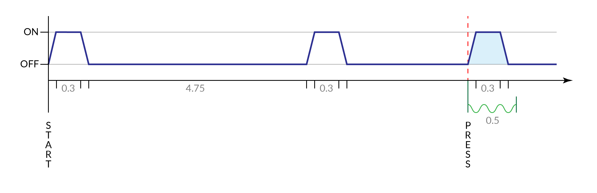
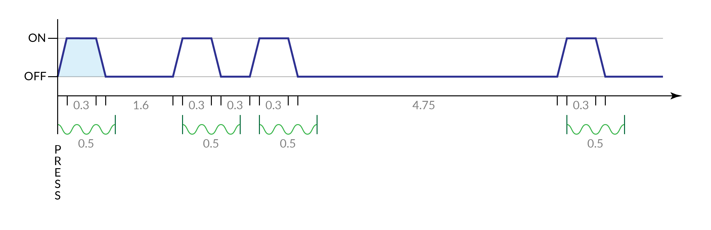
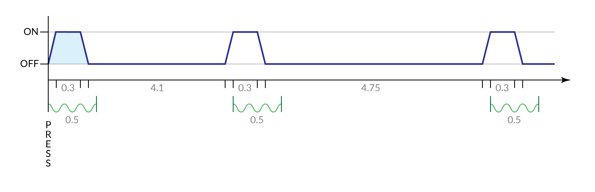

# Simon Says
*This is like one of those toys you played as a kid where you have to match the pattern that appears, except this one is a knockoff that was probably purchased at a dollar store.*

## Behavior
This module generates a random sequence of colors of length `3-5` on start. This sequence will not change during the game.

All solution options are mapped at any given time to keys based on the presence of vowels in the serial number and the current strike state. This updates immediately upon a strike occurring.

The module remains silent until the first input is received. After this point all further interactions and blinks are accompanied by `0.5s` tones matching the color being identified. These tones are sine waves and have the following frequencies.

| Color  | Frequency |
| ------ | --------- |
| Red    | 551.4 Hz  |
| Blue   | 660.7 Hz  |
| Green  | 777.6 Hz  |
| Yellow | 977.5 Hz  |

Blinks begin at the very start of the game. Blinks always consist of a `0.05s` fade in period, a `0.3s` on period, and a `0.05s` fade back to off. Until the first input is made a gap of `4.75s` exists between each blink. Upon the first input the current lighting is interrupted and a tone is immediately begun.

If this input is **correct** the pattern continues after the input blink and a `1.6s` gap. The new longer sequence consists of blinks spaced `0.3s` apart. This will hold true for all further sequences until the module is solved. Note that the `0.5s` tone does not begin until the fade in is complete. If no interaction takes place the `4.75s` gap will resume, now with the longer sequence playing at each interval (now with sound).

If instead an interaction was **incorrect** a strike immediately occurs and all correct inputs are altered. A longer delay of `4.1s` allows time to recover and the sequence begins repeating as usual from then on.

If during any of these times a button is pressed it will always immediately play a tone and interrupt the current status of the pattern. If after `4.75s` no further inputs occur the module reverts back to blinking and forgets the entered presses. Note that presses can also be entered more quickly than the tones or blinks indicate. As the sequence is predetermined all presses are considered regardless of the visible state.

If treated as a look-up table, the button routings are as follows given `R B G Y`.

|              | 0 Strike  |  1 Strike |  2 Strike |
| :----------: | :-------: | :-------: | :-------: |
| **Vowel**    | `B R Y G` | `Y G B R` | `G R Y B` |
| **No Vowel** | `B Y G R` | `R B Y G` | `Y G B R` |
