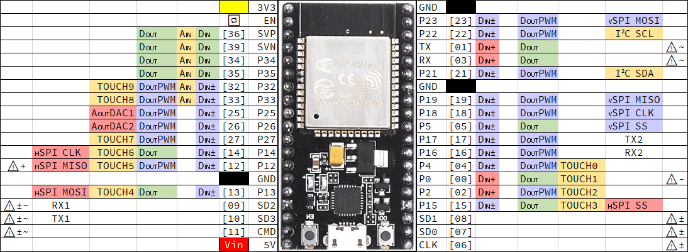

# Package Manager Libraries

• FastLED https://github.com/FastLED/FastLED

• Bounce2 https://github.com/thomasfredericks/Bounce2

# Modified Libraries (available here)

• [0TA](https://github.com/SyberxSpace/KTANE_IRL/tree/master/Supporting_Libraries/0TA) based on https://github.com/SensorsIot/ESP32-OTA

Use these libraries at your own risk as I cannot guarantee compatability or predictable behavoir in all scenarios.

# Other Resources

In most cases I am using NodeMCU-ESP32s boards. I've created this image to assist in choosing pin functionality.

Warnings represent Failure to boot when pulled HIGH [+] or LOW [-], or that the pin boots HIGH [~].
